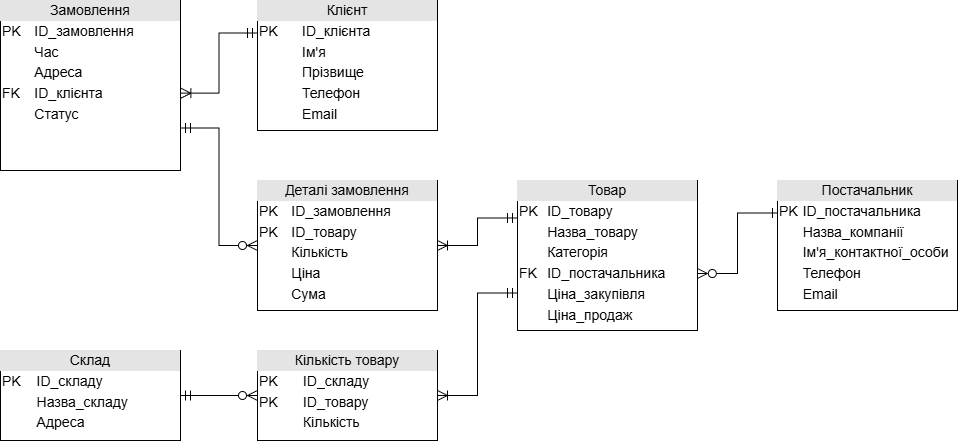
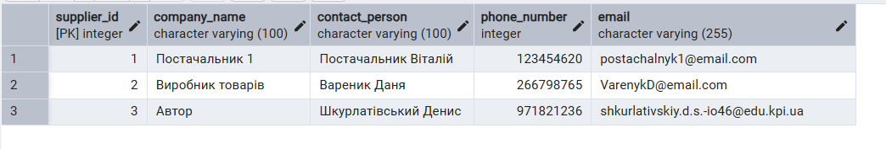
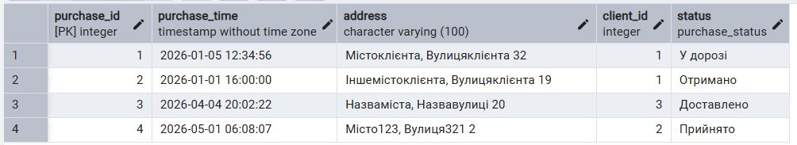
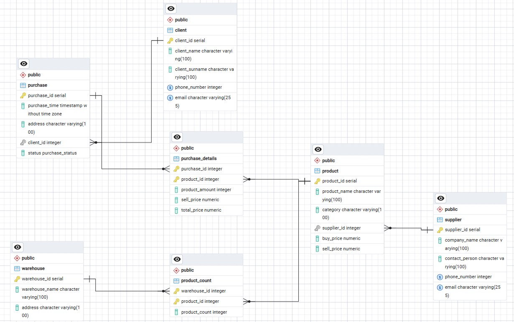

# Шкурлатівський Денис ІО-46 Лабораторна Робота №2 Організація баз даних
## Перетворення ER-діаграми на схему PostgreSQL

---

## Цілі

- Написати SQL DDL-інструкції для створення кожної таблиці з вашої ERD в PostgreSQL.
- Вказати відповідні типи даних для кожного стовпця, вибрати первинний ключ для кожної таблиці та визначити будь-які необхідні зовнішні ключі, обмеження UNIQUE, NOT NULL, CHECK або DEFAULT.
- Вставити зразки рядків (принаймні 3–5 рядків на таблицю) за допомогою `INSERT INTO`.
- Протестувати все в pgAdmin (або іншому клієнті PostgreSQL), щоб переконатися, що таблиці та дані завантажуються правильно.

---

## Хід роботи

Використовуємо попередньо створену діаграму для побудови:



### create-script

```sql
CREATE TABLE IF NOT EXISTS Supplier(
	supplier_id SERIAL PRIMARY KEY,
	company_name VARCHAR(100) NOT NULL,
	contact_person VARCHAR(100) NOT NULL,
	phone_number INTEGER UNIQUE,
	email VARCHAR(255) UNIQUE
);

CREATE TABLE IF NOT EXISTS Product(
	product_id SERIAL PRIMARY KEY,
	product_name VARCHAR(100) NOT NULL,
	category VARCHAR(100) NOT NULL,
	supplier_id INT NOT NULL REFERENCES Supplier(supplier_id),
	buy_price NUMERIC NOT NULL,
	sell_price NUMERIC NOT NULL
);

CREATE TABLE IF NOT EXISTS Warehouse(
	warehouse_id SERIAL PRIMARY KEY,
	warehouse_name VARCHAR(100),
	address VARCHAR(100) NOT NULL
);

CREATE TABLE IF NOT EXISTS Product_count(
	warehouse_id INT NOT NULL REFERENCES Warehouse(warehouse_id),
	product_id INT NOT NULL REFERENCES Product(product_id),
	product_count INT NOT NULL,
	PRIMARY KEY (warehouse_id, product_id)
);

CREATE TABLE IF NOT EXISTS Client(
	client_id SERIAL PRIMARY KEY,
	client_name VARCHAR(100) NOT NULL,
	client_surname VARCHAR(100) NOT NULL,
	phone_number INTEGER UNIQUE,
	email VARCHAR(255) UNIQUE
);

CREATE TYPE purchase_status AS ENUM ('Прийнято', 'У дорозі', 'Доставлено', 'Отримано');

CREATE TABLE IF NOT EXISTS Purchase(
	purchase_id SERIAL PRIMARY KEY,
	purchase_time TIMESTAMP NOT NULL,
	address VARCHAR(100) NOT NULL,
	client_id INT NOT NULL REFERENCES Client(client_id),
	status purchase_status NOT NULL
);

CREATE TABLE IF NOT EXISTS Purchase_details(
	purchase_id INT NOT NULL REFERENCES Purchase(purchase_id),
	product_id INT NOT NULL REFERENCES Product(product_id),
	product_amount INT NOT NULL CHECK (product_amount > 0),
	sell_price NUMERIC NOT NULL,
	total_price NUMERIC GENERATED ALWAYS AS (sell_price * product_amount) STORED,
	PRIMARY KEY (purchase_id, product_id)
);
```

### insert-script

```sql
INSERT INTO Supplier(company_name, contact_person, phone_number, email) VALUES
('Постачальник 1', 'Постачальник Віталій', 0123454620, 'postachalnyk1@email.com'),
('Виробник товарів', 'Вареник Даня', 0266798765, 'VarenykD@email.com'),
('Автор', 'Шкурлатівський Денис', 0971821236, 'shkurlativskiy.d.s.-io46@edu.kpi.ua');

INSERT INTO Product(product_name, category, supplier_id, buy_price, sell_price) VALUES
('Продукт 1', 'Категорія 1', 1, 1, 2),
('Продукт 2', 'Категорія 1', 1, 1, 5),
('Товар', 'Товар(Категорія)', 2, 50, 99),
('Цей файл', 'Лаби з ОБД', 3, 46, 20);

INSERT INTO Warehouse(warehouse_name, address) VALUES
('Склад 1', 'Навзваміста, Назвавулиці 45'),
('Склад 2', 'Назваіншогоміста, Назвавулиці 60');

INSERT INTO Product_count(warehouse_id, product_id, product_count) VALUES
(1, 2, 34),
(2, 4, 68),
(1, 1, 1),
(2, 3, 23),
(2, 2, 2);

INSERT INTO Client(client_name, client_surname, phone_number, email) VALUES
('Віталій', 'Клієнт', 0123456789, 'client1@email.com'),
('В`ячеслав', 'Довготелес', 0987654321, 'Dovhoteles123@email.com'),
('Ім`я', 'Прізвище', 0192837465, 'client@email.com');

INSERT INTO Purchase(purchase_time, address, client_id, status) VALUES
('2026-01-05 12:34:56','Містоклієнта, Вулицяклієнта 32', 1, 'У дорозі'),
('2026-01-01 16:00:00','Іншемістоклієнта, Вулицяклієнта 19', 1, 'Отримано'),
('2026-04-04 20:02:22','Назваміста, Назвавулиці 20', 3, 'Доставлено'),
('2026-05-01 06:08:07','Місто123, Вулиця321 2', 2, 'Прийнято');

INSERT INTO Purchase_details(purchase_id, product_id, product_amount, sell_price) VALUES
(1,1,11,111),
(1,2,12,121),
(2,3,4,56),
(3,1,13,113),
(3,4,43,443),
(3,2,23,223),
(4,4,4,4);
```
### Перший SELECT
```sql
SELECT *
FROM Supplier;
```
Результат:

### Другий SELECT
```sql
SELECT *
FROM Purchase;
```
Результат:

## Структура

> Supplier
>>  Початкова таблиця. Передає свій PK таблиці Product

> Product
>>  Постачається постачальниками, зберігається на складах та є частиною замовлень.

> Warehouse
>>  Склад. Окрім ID має адресу та назву.

> Product_count
>>	Проміжна між Product та Warehouse. Зберігає дані(або NULL) для кожної комбінації ключів.

> Client
>>	Інформація про клієнтів.

> Purchase
>>	Замовлення клієнтів. Мають адресу та час замовлення. 

> Purchase_details
>>	Проміжна між Product та Purchase. Зберігає кількість окремих товарів у замовленні.

### Згенерована ERD


