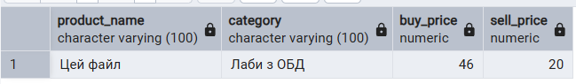
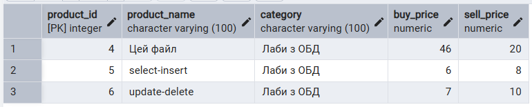
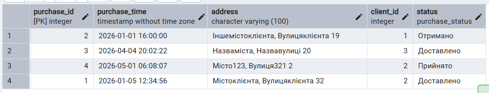
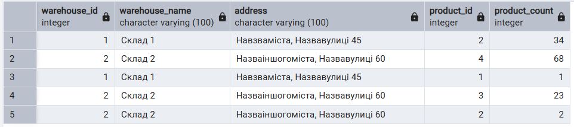
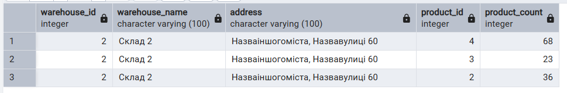

# Шкурлатівський Денис ІО-46 Лабораторна Робота №3 Організація баз даних
## Маніпулювання даними SQL (OLTP)

---

## Цілі

- Написати запити SELECT для отримання даних (включаючи фільтрацію за допомогою WHERE та вибір певних стовпців).
- Практикувати використання операторів INSERT для додавання нових рядків до таблиць.
- Практикувати використання оператора UPDATE для зміни існуючих рядків (використовуючи SET та WHERE).
- Практикувати використання операторів DELETE для безпечного видалення рядків (за допомогою WHERE).
- Вивчити основні операції маніпулювання даними (DML) у PostgreSQL та спостерігати за їхнім впливом.

---

### select-insert

```sql
SELECT 
	p.product_name,
	p.category,
	p.buy_price,
	p.sell_price
FROM Product p
WHERE supplier_id=3;

INSERT INTO Product(product_name, category, supplier_id, buy_price, sell_price) VALUES
('select-insert', 'Лаби з ОБД', 3, 6, 8),
('update-delete', 'Лаби з ОБД', 3, 7, 10),
('file123', 'Ще якийсь файл', 3, 9, 90);

SELECT 
	p.product_id,
	p.product_name,
	p.category,
	p.buy_price,
	p.sell_price
FROM Product p
WHERE supplier_id=3 AND category='Лаби з ОБД';
```
Результат:



### update-delete

```sql
UPDATE Purchase
SET
	status='Доставлено',
	client_id=2
WHERE purchase_id=1;

SELECT * FROM Purchase;

SELECT
	w.warehouse_id,
	w.warehouse_name,
	w.address,
	pr.product_id,
	pr.product_count
FROM Warehouse w
JOIN Product_count pr ON w.warehouse_id=pr.warehouse_id;

UPDATE Product_count
SET
	product_count=0
WHERE warehouse_id=1;

UPDATE Product_count
SET
	product_count=36
WHERE warehouse_id=2 AND product_id=2;

DELETE FROM Product_Count WHERE warehouse_id=1;
DELETE FROM Warehouse WHERE warehouse_id=1;

SELECT
	w.warehouse_id,
	w.warehouse_name,
	w.address,
	pr.product_id,
	pr.product_count
FROM Warehouse w
JOIN Product_count pr ON w.warehouse_id=pr.warehouse_id
WHERE w.warehouse_id=2;
```
Результат:


