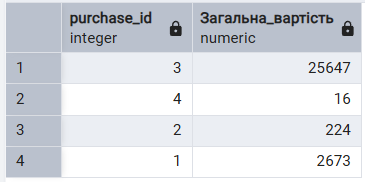
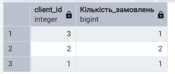
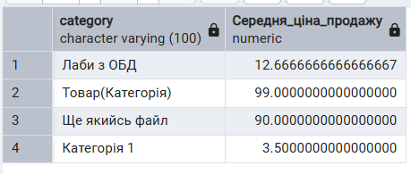
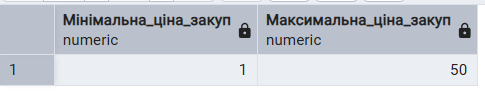
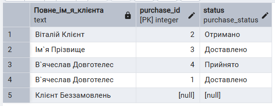
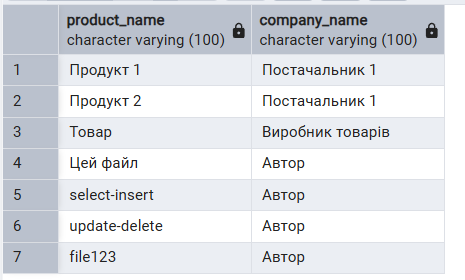
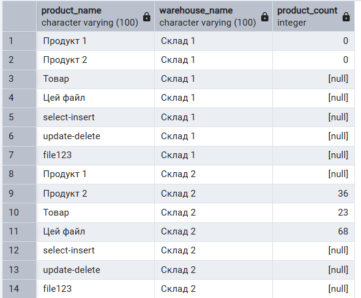
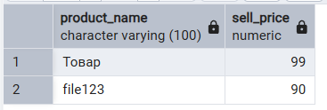
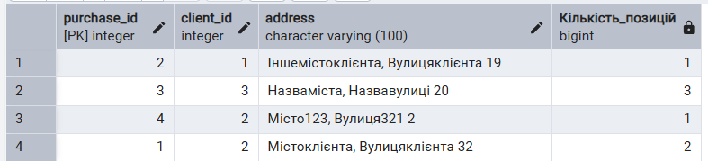
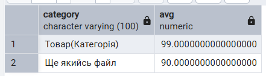

# Шкурлатівський Денис ІО-46 Лабораторна Робота №4 Організація баз даних
## Аналітичні SQL-запити (OLAP)

---

## Цілі

- Використовувати агрегатні функції, такі як ```COUNT```, ```SUM```, ```AVG```, ```MIN``` та ```MAX```, для обчислення зведеної статистики з ваших даних.
- Написати запити GROUP BY для групування рядків за одним або кількома стовпцями та обчислення агрегатів для кожної групи.
- Використовувати HAVING для фільтрації результатів згрупованих запитів на основі агрегованих умов.
- Виконувати операції ```JOIN``` (принаймні ```INNER JOIN``` та ```LEFT JOIN```), щоб об'єднати дані з кількох таблиць.
- Створювати об'єднані запити на агрегацію для кількох таблиць, які об'єднують таблиці та створюють згрупований, агрегований вивід.
- Інтерпретувати результати ваших запитів та пояснити, що робить кожен з них.


---

### lab4

```sql
--Загальна вартість замовленнь
SELECT
	purchase_id,
	SUM(total_price) as Загальна_вартість
FROM Purchase_details
GROUP BY purchase_id;

--Кількість замовлень у клієнта
SELECT
	client_id,
	COUNT(purchase_id) AS Кількість_замовлень
FROM Purchase
GROUP BY client_id;

--Середня ціна товару за категорією
SELECT
	category,
	AVG(sell_price) AS Середня_ціна_продажу
FROM Product
GROUP BY category;

--Мінімальна та максисальна ціни закупки товарів
SELECT
	MIN(buy_price) AS Мінімальна_ціна_закуп,
	MAX(buy_price) AS Максимальна_ціна_закуп
FROM Product;


--Клієнт без замовлень для демонстрації
INSERT INTO Client(client_name, client_surname, phone_number, email) VALUES
('Клієнт', 'Беззамовлень', 1000000001, 'clientnopurchases@email.com')

--Список усіх клієнтів та їх замовлень(або їх відсутності)
SELECT
	cl.client_name || ' ' || cl.client_surname AS Повне_ім_я_клієнта,
	p.purchase_id,
	p.status
FROM Client cl
LEFT JOIN Purchase p ON cl.client_id=p.client_id;

--Список усіх товарів та їх постачальників
SELECT
	p.product_name,
	s.company_name
FROM Product p
JOIN Supplier s ON p.supplier_id=s.supplier_id;

--Product_count з назвами замість ID
SELECT
	p.product_name,
	w.warehouse_name,
	pc.product_count
FROM Product p
CROSS JOIN Warehouse w
FULL JOIN Product_count pc ON (pc.product_id=p.product_id AND pc.warehouse_id=w.warehouse_id);


--Товари ціна яких вища за середню
SELECT
	product_name,
	sell_price
FROM Product
WHERE sell_price>(SELECT AVG(sell_price) FROM Product);

--Список замовлень з відображенням кількостей позицій у них
SELECT
	p.purchase_id,
	p.client_id,
	p.address,
	(SELECT COUNT(*) FROM Purchase_details pd WHERE pd.purchase_id=p.purchase_id) AS Кількість_позицій
FROM Purchase p;


--Категорії товарів з вищою середньою ціню ніж середня ціна з усіх товарів
SELECT
	category,
	AVG(sell_price)
FROM Product
GROUP BY category
HAVING AVG(sell_price)>(SELECT AVG(sell_price) FROM Product);
```
Результат:  
  
  
  
  
  
  
  
  
  
  
