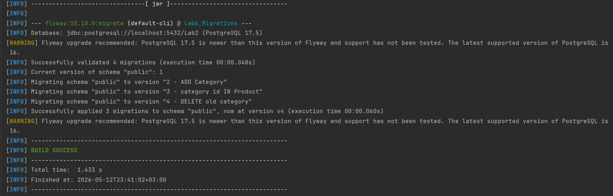
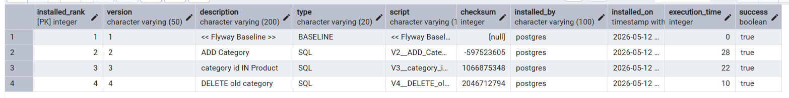
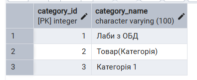
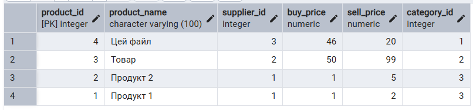

# Шкурлатівський Денис ІО-46 Лабораторна Робота №6 Організація баз даних
## Міграції схем за допомгою Flyway

---

## Цілі

- Використати Flyway для керування схемами та дослідити, як Flyway може аналізувати та змінювати схему вашої бази даних.
- Зрозуміти конвенцію іменування Flyway-скриптів, застосування міграцій, генерування та застосування змін схеми.
- Написати кілька версійних SQL-міграцій для вашої схеми та застосувати їх через Flyway. 
- Перевірити результати змін за допомогою SQL-запитів і задокументувати їх. 
- Навчитися коректно використовувати контролювання версій міграцій у Git (скрипти зберігаються у проекті, а не змінюються після застосування).

---

## Хід роботи

Міграції реалізують винесення категорій в окрему таблицю:  

[1 міграція](src/main/resources/db/migration/V2__ADD_Category.sql) створює таблицю Category та заповнює її даними

[2 міграція](src/main/resources/db/migration/V3__category_id_IN_Product.sql) створює поле category_id у таблиці Product та заповнює його відповідними значеннями

[3 міграція](src/main/resources/db/migration/V4__DELETE_old_category.sql) видаляє поле category у таблиці Product

## Міграції

Нова таблиця Category  

Оновлена таблиця Product  

